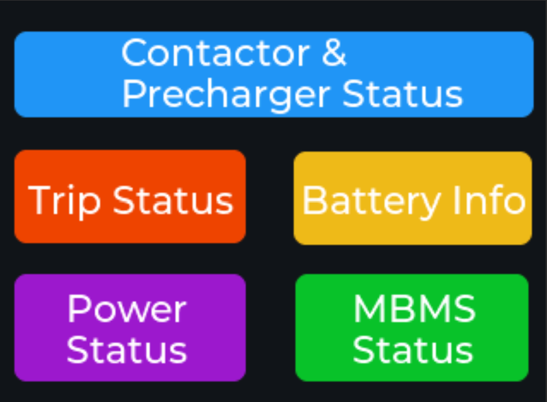
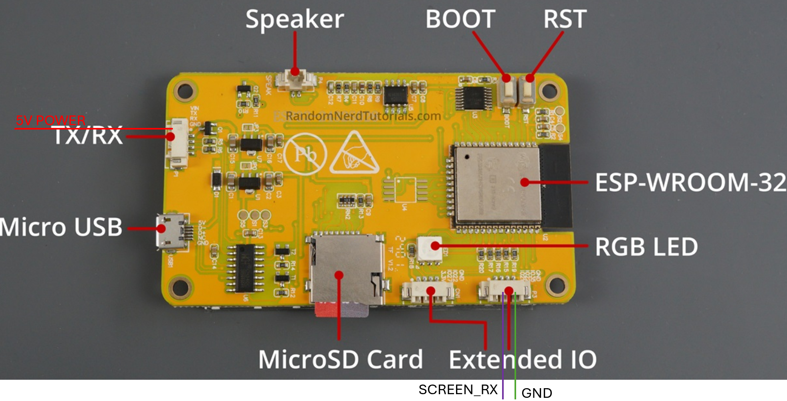
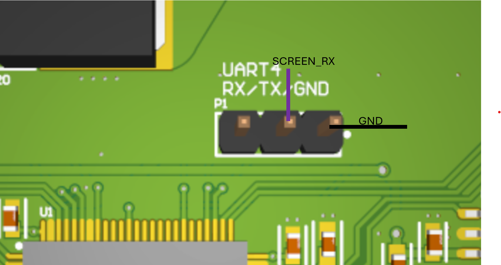
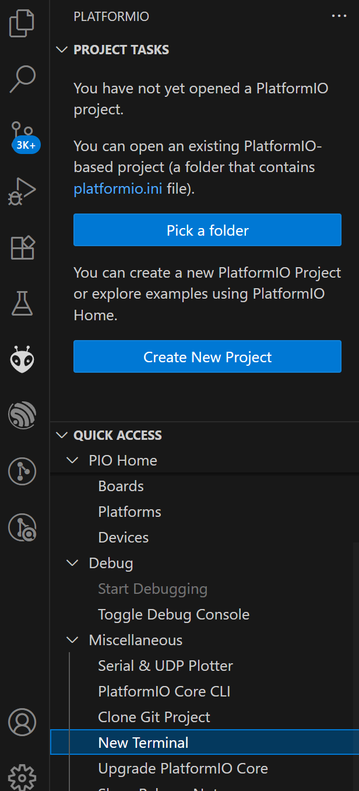

# HomeScreen


# Wiring Diagram

## Wires on Screen

## Specific Wires
- VIN -> POWER 
- GND -> GND 
- IO22 -> SCREEN_RX




## Wires from Screen to MBMS




# Programming the board

1. Install VsCode with Platform IO Extension

2. If missing the lib folders git clone the following folders into /lib/
https://github.com/Bodmer/TFT_eSPI
https://github.com/PaulStoffregen/XPT2046_Touchscreen

3. On the Right Side click the PlatformIO Icon and click on new Terminal



4. In the new terminal cd into the DisplayBoard folder

5. To upload code you can use either of the following lines depending if you want to specify the port number. Make sure the 

``` pio run -e upesy_wroom -t upload ```
OR
```pio run -e upesy_wroom -t upload --upload-port COM6``

Where you can specify the COM Port from the device manager

6. To stream the Serial output log you can use
``` pio device monitor ``` OR
```pio device monitor --port COM3```
Where you can specify the COM Port from the device manager

